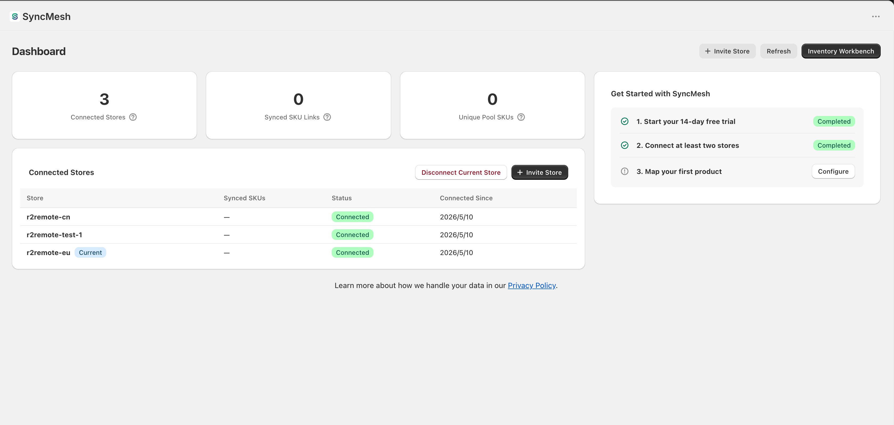
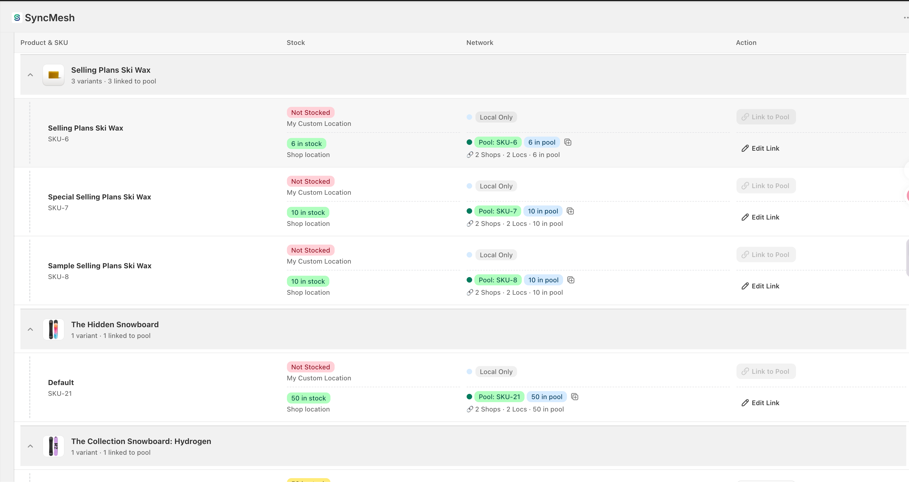
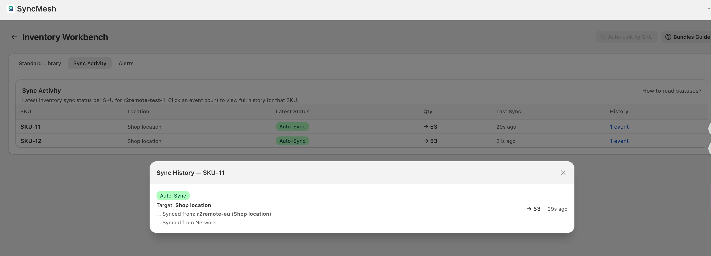
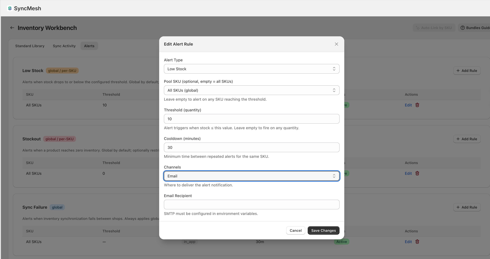

# ⚡ SyncMesh

### Real-Time Inventory Sync for Shopify — Never Oversell Again

---

## 🚀 We're Looking for Beta Testers!

**SyncMesh is now accepting beta users — get free Pro access ($49.99/mo value) in exchange for feedback.**

If you run multiple Shopify stores with a shared warehouse, we want to talk to you. Beta testers get lifetime Pro-tier access with no charges. No credit card required.

**[→ Join the Beta](https://www.r2remote.dev)** • **[→ Read the Docs](docs/user-manual.md)**

---

## 🎯 The Problem You Know Too Well

You're running a flash sale. Two Shopify stores, one warehouse, limited stock. The last unit sells on Store A at 12:00:03. Store B still shows it as available. At 12:00:07, a second customer buys it on Store B. Now you've just sold one physical item twice.

**Result:** cancelled orders, angry customers, bad reviews, refund fees, and a customer service nightmare.

Most sync tools poll every 5–15 minutes. In a flash sale, 15 minutes might as well be forever.

## ⚡ How SyncMesh Is Different

Traditional inventory sync tools **poll** on a timer. SyncMesh uses **event-driven real-time sync** via Redis Streams — when a sale happens in one store, inventory updates propagate to all connected stores in **milliseconds**, not minutes.

| | Traditional Sync | SyncMesh |
|---|---|---|
| Mechanism | Polling (5–15 min) | Event-driven (sub-second) |
| Overselling during spikes | Inevitable | Prevented |
| Multi-location | Often broken | First-class support |
| Audit trail | Limited | Full idempotent ledger |
| Architecture | Single-threaded | Redis Streams + worker pool |

## ✨ Features

- **⚡ Event-Driven Real-Time Sync** — Inventory changes propagate in milliseconds via Redis Streams
- **🔗 Pool SKU System** — Link products across stores to a shared pool identifier
- **🤖 Auto-Link by SKU** — One-click scan to automatically match and link products across stores
- **📊 Full Audit Ledger** — Every inventory change is tracked with idempotency guarantees
- **📍 Multi-Location** — Per-warehouse inventory tracking with location-level sync (Pro/Max)
- **🔔 Smart Alerts** — Low stock, stockout, and sync-failure alerts via in-app, email, or webhook
- **👥 Multi-Store Pairing** — 6-character pairing codes to connect stores in seconds
- **🔐 Encrypted at Rest** — All Shopify access tokens stored with AES-256-GCM

## 📸 Screenshots

  &nbsp;
  
  &nbsp;
  

## 💰 Plans & Pricing

| | Starter | Pro | Max |
|---|---|---|---|
| **Price** | $19.99/mo | $49.99/mo | $129.99/mo |
| **Stores** | 2 | 5 | Unlimited |
| **SKUs** | 1,000 | 10,000 | Unlimited |
| **Locations** | 1 | Multiple | Multiple |
| **Log Retention** | 7 days | 30 days | 365 days |
| **Free Trial** | 14 days | 14 days | 14 days |

## 🛠 Tech Stack

| Layer | Technology |
|---|---|
| Backend | Go, Redis Streams, pgx |
| Frontend | React 18, TypeScript, Shopify Polaris, Vite |
| Database | PostgreSQL (Cloud SQL) |
| Queue | Redis (GCP Memorystore) |
| Hosting | Google Cloud Run |
| Monitoring | Grafana Cloud, Sentry, PostHog |

## 📖 Documentation

- **[User Manual](docs/user-manual.md)** — Full guide: installation, dashboard, inventory workbench, pairing, alerts, FAQ
- **[Privacy Policy](https://www.r2remote.dev/privacy)** — Data handling, GDPR compliance

## 🔒 Security

- Shopify access tokens encrypted at rest (AES-256-GCM)
- All data hosted on Google Cloud Platform (us-central1)
- HMAC-verified webhooks with replay protection
- JWT session tokens with per-request validation
- GDPR compliant — automatic data deletion on app uninstall

---

### 📦 [Install on Shopify](https://www.r2remote.dev) • 🧪 [Join Beta Program](https://www.r2remote.dev) • 📖 [Read the Docs](docs/user-manual.md)

